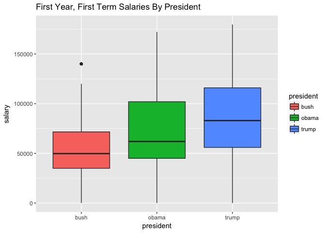

Presidential First Term Analysis
================

Comparing Pay Among First-term Presidents
-----------------------------------------

Recently the Trump Administration released it's first report of what they pay their staff. I thought it would be interesting to do an analysis that compares it to past EOP offices.

For this analysis, we are going to look at the first year of Presidents Trump, Obama and Bush.

| president |  salary|
|:----------|-------:|
| bush      |   49789|
| obama     |   65000|
| trump     |   89000|

Here we see that Trump's median salary of 89000 is greater than both former president Bush and Obama.

That could be expected as wages should increase with cost of living over time.

The next question I have is: How many Trump staffers are paid the maximum compared to previous administrations? Let's take a look:

| president |  salary|  count|
|:----------|-------:|------:|
| trump     |  179700|     22|
| obama     |  172200|     22|
| bush      |  140000|     17|

In this piece of analysis, I have excluded detailees, as their salaries are paid by other departments. Here I've found that Trump ties Obama for having the largest count of highest paid employees on staff during the first year of their first term. Let's take another look visually to confirm what we're seeing:

Staff Sizes
-----------

Let's take a look at staff sizes and salaries over time:

|  year| president | party      | term  |  medianSalary|  meanSalary|  staffSize|
|-----:|:----------|:-----------|:------|-------------:|-----------:|----------:|
|  2001| bush      | republican | first |         49789|    58042.17|        397|
|  2009| obama     | democrat   | first |         65000|    80384.44|        487|
|  2017| trump     | republican | first |         89000|    94872.00|        377|

Here it appears that President Trump is spending more per staff over all, but with a smaller staff size. This could be problematic for the president in the long run.

So who are these top paid staff members of Trump's administration?

| employee\_name        | position                                                                                                                    |  salary| status   |
|:----------------------|:----------------------------------------------------------------------------------------------------------------------------|-------:|:---------|
| house, mark s         | senior policy advisor                                                                                                       |  187100| detailee |
| bannon, stephen k     | assistant to the president and chief strategist and senior counselor                                                        |  179700| employee |
| bossert, thomas p     | assistant to the president for homeland security and counterterrorism                                                       |  179700| employee |
| bremberg, andrew p    | assistant to the president and director of the domestic policy council                                                      |  179700| employee |
| conway, kellyanne e   | assistant to the president and senior counselor                                                                             |  179700| employee |
| dearborn, ricky a     | assistant to the president and deputy chief of staff for legislative, cabinet, intergovernmental affairs and implementation |  179700| employee |
| destefano, john j     | assistant to the president and director of presidential personnel                                                           |  179700| employee |
| greenblatt, jason d   | assistant to the president and special representative for international negotiations                                        |  179700| employee |
| hagin, joseph w       | assistant to the president and deputy chief of staff for operations                                                         |  179700| employee |
| hicks, hope c         | assistant to the president and director of strategic communications                                                         |  179700| employee |
| kellogg, jr, joseph k | assistant to the president and executive secretary and chief of staff for the national security council                     |  179700| employee |
| manigault, omarosa o  | assistant to the president and director of communications for the office of public liaison                                  |  179700| employee |
| mcfarland, kathleen t | assistant to the president and deputy national security advisor                                                             |  179700| employee |
| mcgahn, ii, donald f  | assistant to the president and counsel to the president                                                                     |  179700| employee |
| miller, stephen       | assistant to the president and senior advisor for policy                                                                    |  179700| employee |
| porter, robert r      | assistant to the president and white house staff secretary                                                                  |  179700| employee |
| powell, dina h        | assistant to the president and deputy national security advisor for strategy                                                |  179700| employee |
| priebus, reinhold r   | assistant to the president and chief of staff                                                                               |  179700| employee |
| reynolds, lindsay b   | assistant to the president and chief of staff to the first lady                                                             |  179700| employee |
| scavino, daniel j     | assistant to the president and director of social media                                                                     |  179700| employee |
| short, marc t         | assistant to the president and director of the office of legislative affairs                                                |  179700| employee |
| sifakis, george a     | assistant to the president and director of the office of public liaison                                                     |  179700| employee |
| spicer, sean m        | assistant to the president and press secretary                                                                              |  179700| employee |

Other than Mark House who is a detailee, all are employees. Probably one of the more well known employees is Steve Bannnon, who is listed as Assistant to the President and Chief Strategist and Senior Counselor.

As it's noted in Wikipedia, each president gets to choose their own cabinet, which means they can also give out their own titles as well. That makes an analysis more difficult, so let's look and see if other presidents retain a senior counsel on staff.

| employee\_name       |  salary| position                                                                     |  year| status   | president |
|:---------------------|-------:|:-----------------------------------------------------------------------------|-----:|:---------|:----------|
| bannon, stephen k    |  179700| assistant to the president and chief strategist and senior counselor         |  2017| employee | trump     |
| carroll, jr, james w |  140000| special assistant to the president and senior counsel to the president       |  2017| employee | trump     |
| conway, kellyanne e  |  179700| assistant to the president and senior counselor                              |  2017| employee | trump     |
| hudson, hope r       |  155000| deputy assistant to the president and chief of staff to the senior counselor |  2017| employee | trump     |
| remus, dana a        |  136971| special assistant to the president and senior counsel to the president       |  2016| employee | obama     |
| whitney, margaret e  |  136971| special assistant to the president and senior counsel to the president       |  2016| employee | obama     |
| martz, stephanie a   |  136350| special assistant to the president and senior counsel to the president       |  2015| employee | obama     |
| mcquaid, nicholas r  |  135000| special assistant to the president and senior counsel to the president       |  2015| employee | obama     |
| maltby, jeremy       |  135000| special assistant to the president and senior counsel to the president       |  2014| employee | obama     |
| kang, christopher d  |  135000| special assistant to the president and senior counsel to the president       |  2013| employee | obama     |
| maltby, jeremy       |  135000| special assistant to the president and senior counsel to the president       |  2013| employee | obama     |
| croley, steven p     |  135000| special assistant to the president and senior counsel to the president       |  2012| employee | obama     |
| kang, christopher d  |  135000| special assistant to the president and senior counsel to the president       |  2012| employee | obama     |

Also of note, Assistants, Special Assistants and Deputy Assistants all indicate different roles within office tiers.
